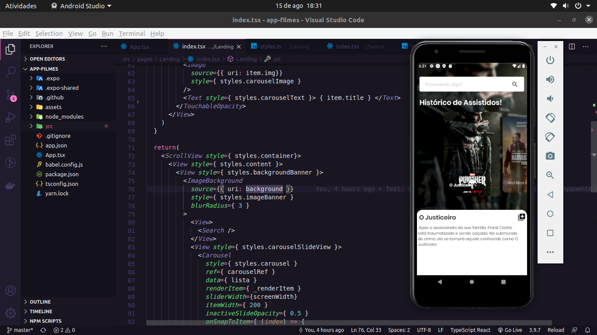

<h1 align="center">
    <br>Moovie<br/>
    React Native
</h1>

<p align="center">
   
</p>
<p align="center">
  <a href="#bookmark-sobre">Sobre</a>&nbsp;&nbsp;&nbsp;|&nbsp;&nbsp;&nbsp;
  <a href="#rocket-tecnologias">Tecnologias</a>&nbsp;&nbsp;&nbsp;|&nbsp;&nbsp;&nbsp;
  <a href="#boom-como-executar">Como Executar</a>&nbsp;&nbsp;&nbsp;|&nbsp;&nbsp;&nbsp;
  <a href="#memo-licença">Licença</a>
</p>

## :bookmark: Sobre

O **Moovie** é apenas uma interface bem simples para gerenciamento de filmes e séries já vistas.
  
Foi realizada para fins de estudos do React Native.

## Tecnologias

-  [Typescript](https://www.typescriptlang.org/)
-  [React Native](http://facebook.github.io/react-native/)
-  [Expo](https://expo.io/)

## :boom: Como Executar

- ### **Pré-requisitos**

  - É **necessário** possuir o **[Node.js](https://nodejs.org/en/)** instalado no computador
  - É **necessário** possuir o **[Git](https://git-scm.com/)** instalado e configurado no computador
  - Também, é **preciso** ter um gerenciador de pacotes seja o **[NPM](https://www.npmjs.com/)** ou **[Yarn](https://yarnpkg.com/)**.
  - Por fim, é **essencial** ter o **[Expo](https://expo.io/)** instalado de forma global na máquina

1. Faça um clone do repositório:

```sh
  $ git clone https://github.com/EusRique/app-filmes.git
```

2. Executando a Aplicação:

```sh

  # Aplicação mobile
  $ cd app-filmes
  # Instalando as dependências do projeto.
  $ yarn # ou npm install
  # Inicie a aplicação mobile
  $ yarn start # ou npm start
```


## :memo: Licença

Esse projeto está sob a licença MIT. Veja o arquivo [LICENSE](LICENSE.md) para mais detalhes.

---
<sup>Projeto desenvolvido apenas para fins de estudos.</sup>

<p align="center">
   
   
</p>